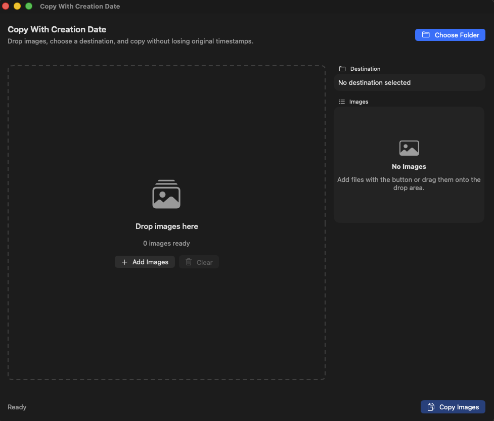

# Copy With Creation Date

By Ramiro Montes De Oca (with a lillte help from CODEX 5.5)

## Download

Use one of these ready-to-install distribution packages:

- [Download the DMG](dist/Copy%20With%20Creation%20Date.dmg)
- [Download the PKG Installer](dist/Copy%20With%20Creation%20Date%20Installer.pkg)

The `.pkg` installer installs the app into `/Applications`.

The `.dmg` file lets users drag `Copy With Creation Date.app` into Applications manually.

If macOS says the app is damaged or cannot be opened, it is because this free release is not notarized by Apple. After downloading, open Terminal and run:

```sh
xattr -dr com.apple.quarantine "/Applications/Copy With Creation Date.app"
```

Then open the app again from Applications.

Copy With Creation Date is a small native macOS app for copying image files while preserving their original **Date Created** and **Date Modified** timestamps.

It solves a common Finder copy/paste problem: when images are copied in some workflows, the visible creation date can change to the copy time. This app copies the files and then explicitly restores the original timestamp metadata on the copied files.




## Features

- Drag and drop multiple images into the app.
- Select a destination folder before copying.
- Preserve original `Date Created` metadata.
- Preserve original `Date Modified` metadata.
- Avoid overwriting files by automatically adding a numeric suffix, such as `photo 2.jpg`.
- Supports common macOS image types through Apple's Uniform Type Identifier image handling.
- Includes a generated macOS-style app icon.

## Requirements

- macOS 13 Ventura or newer
- Xcode Command Line Tools or Xcode
- Swift 5.9 or newer

To check whether Swift is installed:

```sh
swift --version
```

If Swift is not installed, install Apple's Command Line Tools:

```sh
xcode-select --install
```

## Installation

To build from source, clone the repository:

```sh
git clone <repository-url>
cd CopyWithCreationDate
```

Build the app:

```sh
Scripts/build-app.sh
```

Open the app:

```sh
open "dist/Copy With Creation Date.app"
```

Optional: move the generated app into your Applications folder:

```sh
cp -R "dist/Copy With Creation Date.app" /Applications/
```

## Installer Package

To create a double-click macOS installer that installs the app into `/Applications`:

```sh
Scripts/build-installer.sh
```

The installer is created at:

```text
dist/Copy With Creation Date Installer.pkg
```

Users can double-click that `.pkg` file and follow the macOS installer prompts. The app will be installed into:

```text
/Applications/Copy With Creation Date.app
```

## DMG Distribution

To create a DMG containing the compiled app bundle:

```sh
Scripts/build-dmg.sh
```

The DMG is created at:

```text
dist/Copy With Creation Date.dmg
```

Users can open the DMG and drag `Copy With Creation Date.app` into their Applications folder.

## Usage

1. Open `Copy With Creation Date.app`.
2. Drag one or more image files into the drop area, or click **Add Images**.
3. Click **Choose Folder** and select where the copied images should go.
4. Click **Copy Images**.
5. Check the copied files in Finder. Their original creation and modification timestamps should be preserved.

## Development

Run the app from source:

```sh
swift run
```

Run the tests:

```sh
swift test
```

Create a release app bundle:

```sh
Scripts/build-app.sh
```

Create a macOS installer package:

```sh
Scripts/build-installer.sh
```

Create a DMG:

```sh
Scripts/build-dmg.sh
```

The generated app bundle is created at:

```text
dist/Copy With Creation Date.app
```

## How Timestamp Preservation Works

The copy logic reads the source file's filesystem attributes before copying. After the file is copied, the app sets the copied file's `creationDate` and `modificationDate` attributes to match the original file.

The core behavior is tested in `Tests/CopyWithCreationDateTests/CopyEngineTests.swift`.

## Notes

- The app is intended for image files.
- Existing files are not overwritten.
- The generated `.dmg` and `.pkg` files in `dist/` are included for distribution.
- This project is ad-hoc signed but not Apple-notarized. Some Macs may require removing the download quarantine attribute before opening the app.
